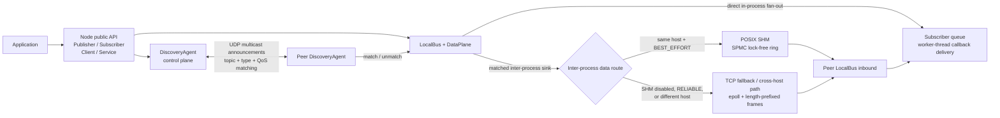

# mini_middleware

mini_middleware is a DDS-style, brokerless C++17 robotics middleware project that combines typed Protobuf Pub/Sub and RPC with UDP discovery, shared-memory and TCP transports, QoS, CLI inspection, and a reproducible benchmark.

## Architecture



Discovery is the control plane: participants periodically announce endpoints and remove timed-out peers. A publication fans out directly to in-process subscribers; after a compatible inter-process match, the data plane additionally routes same-host best-effort traffic through SHM and other traffic through TCP. The current cross-host limitation is called out [below](#current-limitations).

## Implemented Scope

| Phase | Implemented behavior |
|---|---|
| 1 - Core | `Node`, typed `Publisher<T>` / `Subscriber<T>`, Protobuf serialization, topic/type checks, in-process fan-out, bounded subscriber queues, and callback worker threads. |
| 2 - Discovery | Brokerless UDP multicast announcements, participant/endpoint snapshots, topic + type matching, reliability compatibility, periodic liveliness, and match/unmatch callbacks. |
| 3 - TCP | Peer data channels using nonblocking sockets, `epoll`, four-byte length-prefixed frames, connection reuse, and inbound delivery without forwarding loops. |
| 4 - SHM | Same-host POSIX SHM routing with a 32-slot, single-writer/multi-reader lock-free ring; sequence checks detect overwrite and torn reads. |
| 5 - QoS | `BEST_EFFORT` / `RELIABLE` requested-vs-offered matching plus local `KEEP_LAST` / `KEEP_ALL` subscriber history and depth. Reliable readers route through TCP. |
| 6 - RPC | Typed client/service APIs built over Pub/Sub, request IDs, per-client reply topics, bounded client waits, and handler/serialization error replies. |
| 7 - CLI/config | `mm topic list`, `echo`, and `hz`; built-in formatting for `mm.StringMsg`, `mm.Point3D`, and `mm.PointCloud`; a small YAML configuration subset. |
| 8 - Evidence | `mm_bench` SHM/TCP modes, latency/throughput statistics, argument validation, and a full unit/integration suite. |

The detailed progression is in the [roadmap](docs/superpowers/specs/2026-06-15-mini-middleware-roadmap.md); each phase also has a design and implementation plan under [`docs/superpowers`](docs/superpowers/).

## Build and Verify on Ubuntu 20.04

Prerequisites are a C++17 compiler, CMake 3.15+, Protobuf, POSIX threads/SHM, and GoogleTest. On a clean Ubuntu 20.04 installation:

```bash
sudo apt update
sudo apt install -y build-essential cmake protobuf-compiler libprotobuf-dev libgtest-dev

cmake -S . -B build
cmake --build build -j"$(nproc)"
(cd build && ctest --output-on-failure)
```

The final command should report `100% tests passed, 0 tests failed out of 41`. Tests are registered only when CMake finds GoogleTest, which is why `libgtest-dev` is included above.

## Minimal Pub/Sub Demo

Start the CLI subscriber first:

```bash
build/cli/mm topic echo /chatter --type mm.StringMsg --count 3
```

In a second terminal, start the example publisher:

```bash
build/examples/shm_pubsub_demo talker
```

The CLI exits after printing three messages. Both processes use default same-host SHM routing; stop the publisher with `Ctrl-C`. Useful inspection commands are:

```bash
build/cli/mm topic list --wait-ms 1500
build/cli/mm topic hz /chatter --type mm.StringMsg --window 10 --count 20
```

## Configuration

The CLI accepts a deliberately small YAML subset with these implemented keys:

```yaml
node:
  name: interview_cli
transport:
  enable_shm: true
discovery:
  group: 239.255.0.1
  port: 7400
qos:
  reliability: best_effort
  history: keep_last
  depth: 16
```

Save it as `demo.yaml` and pass it to a CLI command:

```bash
build/cli/mm topic list --config demo.yaml --wait-ms 1500
```

`node`, `transport`, and `discovery` configure the CLI node. The parser validates the `qos` section, but the current CLI command handlers do not yet pass those QoS values into their subscribers; see [Current Limitations](#current-limitations).

## Benchmark

`mm_bench` creates publisher and subscriber nodes in one process, waits for normal discovery/routing, sends timestamped `mm.StringMsg` messages, and reports completed-message throughput and end-to-end callback latency. `--mode tcp` disables SHM so the loopback TCP path is exercised.

Automated benchmark tests cover argument parsing and statistics calculations. Executable end-to-end behavior is verified by running the SHM and TCP smoke commands below, which exercise discovery, routing, delivery, and completion checks.

```bash
# Same-host shared-memory route
build/bench/mm_bench --mode shm --count 10000 --payload-bytes 256 --topic /bench

# Forced same-host TCP route
build/bench/mm_bench --mode tcp --count 10000 --payload-bytes 256 --topic /bench

build/bench/mm_bench --help
```

SHM messages must fit the 256 KiB serialized slot. A run that times out or receives fewer messages exits nonzero.

### Representative Output (Example Only)

These are real 1,000-message smoke runs from a Debug build under WSL on 2026-06-27. They demonstrate the report format and successful completion, not a portable performance claim; host load, virtualization, build type, and payload size change the results.

```text
$ build/bench/mm_bench --mode shm --count 1000 --payload-bytes 256
mode: shm
messages: 1000
payload_bytes: 256
received: 1000
duration_ms: 9.12
throughput_msg_s: 109661.15
latency_us_avg: 133.31
latency_us_p50: 126
latency_us_p95: 177
latency_us_p99: 447

$ build/bench/mm_bench --mode tcp --count 1000 --payload-bytes 256
mode: tcp
messages: 1000
payload_bytes: 256
received: 1000
duration_ms: 53.10
throughput_msg_s: 18830.97
latency_us_avg: 1043.13
latency_us_p50: 853
latency_us_p95: 2070
latency_us_p99: 2274
```

## 3-5 Minute Interview Walkthrough

1. **0:00-0:45 - Frame the system.** Use the diagram to separate decentralized discovery/control from P2P delivery and explain the route decision.
2. **0:45-1:30 - Establish correctness.** Run `(cd build && ctest --output-on-failure)` and point out the transport, discovery, QoS, RPC, CLI, and benchmark coverage in the full test suite.
3. **1:30-2:30 - Show live Pub/Sub.** Run the CLI `topic echo` and the `/chatter` publisher in two terminals; optionally show `topic list` or `topic hz`.
4. **2:30-3:30 - Show evidence.** Run the 1,000-message SHM and TCP benchmark commands and compare routes, received counts, and report fields without treating one run as a universal result.
5. **3:30-5:00 - Open the design.** Walk through `Node` match callbacks, `DataPlane::use_shm`, the SHM sequence protocol, and one handled failure; close with the limitations below.

## Interview Talking Points

- **One endpoint API, multiple transports:** `LocalBus` fans out to local subscribers and transport-backed sinks, so discovery can add/remove routes without changing `Publisher<T>`.
- **Control/data-plane split:** UDP multicast makes discovery brokerless and simple for a LAN demo; periodic announcements and a five-second default liveliness timeout remove dead peers.
- **QoS affects compatibility and routing:** a reliable reader does not match a best-effort writer; same-host best-effort uses SHM, while reliable traffic uses TCP.
- **SHM favors nonblocking writer progress and bounded ring memory over guaranteed delivery:** writes do not wait for readers, and the fixed-size ring may overwrite old data. Per-reader cursors and sequence rechecks count overruns and reject torn copies.
- **TCP favors portability of message size and ordered delivery:** nonblocking `epoll` transports use framed Protobuf envelopes and reuse a connection per peer, at the cost of socket and copy overhead.
- **Failures are explicit:** malformed announcements/data are dropped, type/QoS mismatches do not match, RPC calls time out, handler exceptions become error replies, oversized SHM benchmark payloads are rejected, and incomplete benchmarks exit nonzero.
- **Lifecycle ordering matters:** subscriber workers, discovery, SHM readers, outbound connections, and TCP servers are stopped/joined in an order that prevents callbacks into destroyed state.

## Current Limitations

- Linux/x86-64 is the tested target: the transport uses `epoll`, POSIX SHM, and requires lock-free 64-bit atomics.
- The route logic recognizes different hosts, but `Node` currently advertises `127.0.0.1`; cross-host end-to-end use needs a configurable/non-loopback advertised address and has not been demonstrated here.
- SHM is best-effort only, has 32 slots and a 256 KiB serialized-message ceiling, and does not fall back to TCP if segment creation fails. It avoids the socket path but is not end-to-end zero-copy: Protobuf serialization and ring/subscriber copies remain.
- TCP has no reconnect/backoff or application-level retransmission; sends attempted before an asynchronous connection is ready can fail.
- Discovery is LAN multicast with no persistence, partitions/rejoin protocol, authentication, authorization, or encryption.
- The configuration reader supports only the shown YAML shape. CLI message formatting is compiled for three Protobuf types, and parsed QoS config is not yet wired into CLI-created subscribers.
- The benchmark is demo-grade: two nodes in one process, Debug by default, no warm-up, CPU pinning, allocation accounting, CSV export, cross-machine orchestration, or statistical confidence analysis.
- There is no packaging, install target, CI pipeline, or compatibility guarantee yet.
