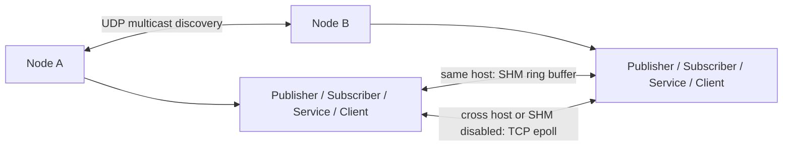

# Phase 8 Benchmark and Demo Documentation Implementation Plan

> **For agentic workers:** REQUIRED SUB-SKILL: Use superpowers:subagent-driven-development (recommended) or superpowers:executing-plans to implement this plan task-by-task. Steps use checkbox (`- [ ]`) syntax for tracking.

**Goal:** Add a short-running benchmark executable plus README/demo documentation so Phase 8 turns the middleware into a campus-recruiting presentation package.

**Architecture:** Create a new `bench` module with a testable argument parser, a testable statistics library, and one `mm_bench` executable that drives two same-process `Node` instances through the normal Pub/Sub APIs. Keep benchmark code outside `core`, reuse `mm.StringMsg`, and update README/roadmap only after the benchmark and tests are green.

**Tech Stack:** C++17, CMake, GTest, protobuf-generated `mm.StringMsg`, existing `mm_core`, `mm_proto`, and Markdown/Mermaid for docs.

---

## File Structure

- Create `bench/CMakeLists.txt`: builds `mm_bench_lib` and `mm_bench`.
- Create `bench/include/bench/bench_args.h`: public benchmark CLI parsing API.
- Create `bench/src/bench_args.cpp`: benchmark CLI parser implementation.
- Create `bench/include/bench/stats.h`: benchmark statistics API.
- Create `bench/src/stats.cpp`: percentile, average, duration, and throughput calculations.
- Create `bench/src/main.cpp`: executable benchmark runner and report printer.
- Modify `CMakeLists.txt`: add `add_subdirectory(bench)` before tests.
- Modify `tests/CMakeLists.txt`: add `test_bench_args` and `test_bench_stats`.
- Create `tests/test_bench_args.cpp`: parser tests.
- Create `tests/test_bench_stats.cpp`: statistics tests.
- Modify `README.md`: replace early scaffold with current project overview, architecture, build, verification, CLI, benchmark, and interview talking points.
- Modify `docs/superpowers/specs/2026-06-15-mini-middleware-roadmap.md`: mark Phase 8 complete after implementation.

## Task 1: Benchmark Argument Parser

**Files:**
- Create: `bench/include/bench/bench_args.h`
- Create: `bench/src/bench_args.cpp`
- Create: `tests/test_bench_args.cpp`
- Modify: `bench/CMakeLists.txt`
- Modify: `CMakeLists.txt`
- Modify: `tests/CMakeLists.txt`

- [ ] **Step 1: Add failing parser tests**

Create `tests/test_bench_args.cpp`:

```cpp
#include "bench/bench_args.h"

#include <gtest/gtest.h>

#include <string>
#include <vector>

using namespace mm::bench;

namespace {

ParseResult parse(std::vector<std::string> args) {
    std::vector<char*> argv;
    argv.reserve(args.size());
    for (auto& arg : args) {
        argv.push_back(arg.data());
    }
    return parse_bench_args(static_cast<int>(argv.size()), argv.data());
}

}  // namespace

TEST(BenchArgs, DefaultsToShmDemoRun) {
    auto result = parse({"mm_bench"});

    ASSERT_TRUE(result.ok) << result.message;
    EXPECT_FALSE(result.help);
    EXPECT_EQ(result.options.mode, BenchMode::SHM);
    EXPECT_EQ(result.options.count, 10000u);
    EXPECT_EQ(result.options.payload_bytes, 256u);
    EXPECT_EQ(result.options.topic, "/bench");
}

TEST(BenchArgs, ParsesTcpModeAndNumericOptions) {
    auto result = parse({"mm_bench", "--mode", "tcp", "--count", "42",
                         "--payload-bytes", "1024", "--topic", "/demo"});

    ASSERT_TRUE(result.ok) << result.message;
    EXPECT_EQ(result.options.mode, BenchMode::TCP);
    EXPECT_EQ(result.options.count, 42u);
    EXPECT_EQ(result.options.payload_bytes, 1024u);
    EXPECT_EQ(result.options.topic, "/demo");
}

TEST(BenchArgs, ParsesShmModeExplicitly) {
    auto result = parse({"mm_bench", "--mode", "shm"});

    ASSERT_TRUE(result.ok) << result.message;
    EXPECT_EQ(result.options.mode, BenchMode::SHM);
}

TEST(BenchArgs, HelpExitsZero) {
    auto result = parse({"mm_bench", "--help"});

    EXPECT_TRUE(result.ok);
    EXPECT_TRUE(result.help);
    EXPECT_EQ(result.exit_code, 0);
    EXPECT_NE(result.message.find("Usage:"), std::string::npos);
}

TEST(BenchArgs, RejectsInvalidMode) {
    auto result = parse({"mm_bench", "--mode", "udp"});

    EXPECT_FALSE(result.ok);
    EXPECT_EQ(result.exit_code, 2);
    EXPECT_NE(result.message.find("unsupported mode"), std::string::npos);
}

TEST(BenchArgs, RejectsMissingOptionValue) {
    auto result = parse({"mm_bench", "--count"});

    EXPECT_FALSE(result.ok);
    EXPECT_EQ(result.exit_code, 2);
    EXPECT_NE(result.message.find("--count requires a value"), std::string::npos);
}

TEST(BenchArgs, RejectsAnotherFlagAsOptionValue) {
    auto result = parse({"mm_bench", "--topic", "--count"});

    EXPECT_FALSE(result.ok);
    EXPECT_EQ(result.exit_code, 2);
    EXPECT_NE(result.message.find("--topic requires a value"), std::string::npos);
}

TEST(BenchArgs, RejectsNonPositiveCount) {
    auto result = parse({"mm_bench", "--count", "0"});

    EXPECT_FALSE(result.ok);
    EXPECT_EQ(result.exit_code, 2);
    EXPECT_NE(result.message.find("--count must be positive"), std::string::npos);
}

TEST(BenchArgs, RejectsInvalidNumber) {
    auto result = parse({"mm_bench", "--payload-bytes", "abc"});

    EXPECT_FALSE(result.ok);
    EXPECT_EQ(result.exit_code, 2);
    EXPECT_NE(result.message.find("--payload-bytes must be a positive integer"), std::string::npos);
}
```

- [ ] **Step 2: Wire the new test target so it fails at compile time**

Create a temporary `bench/CMakeLists.txt` containing only the target names that later steps will fill:

```cmake
add_library(mm_bench_lib STATIC
    src/bench_args.cpp
)

target_include_directories(mm_bench_lib PUBLIC
    ${CMAKE_CURRENT_SOURCE_DIR}/include
)
```

Modify top-level `CMakeLists.txt`:

```cmake
add_subdirectory(bench)                # benchmark/demo tooling
```

Add it after `add_subdirectory(cli)` and before `add_subdirectory(examples)`.

Modify `tests/CMakeLists.txt` inside `if(GTest_FOUND)`:

```cmake
    add_executable(test_bench_args test_bench_args.cpp)
    target_link_libraries(test_bench_args PRIVATE
        mm_bench_lib
        GTest::gtest_main
    )
    add_test(NAME test_bench_args COMMAND test_bench_args)
```

Run:

```bash
cmake -S . -B build
cmake --build build --target test_bench_args -j$(nproc)
```

Expected: FAIL because `bench/bench_args.h` and `bench/src/bench_args.cpp` do not exist yet.

- [ ] **Step 3: Implement the parser API**

Create `bench/include/bench/bench_args.h`:

```cpp
#pragma once

#include <cstddef>
#include <string>

namespace mm::bench {

enum class BenchMode {
    SHM,
    TCP,
};

struct BenchOptions {
    BenchMode mode = BenchMode::SHM;
    std::size_t count = 10000;
    std::size_t payload_bytes = 256;
    std::string topic = "/bench";
};

struct ParseResult {
    bool ok = false;
    bool help = false;
    int exit_code = 2;
    std::string message;
    BenchOptions options;
};

std::string bench_usage();
const char* mode_name(BenchMode mode);
ParseResult parse_bench_args(int argc, char** argv);

}  // namespace mm::bench
```

Create `bench/src/bench_args.cpp`:

```cpp
#include "bench/bench_args.h"

#include <cstdlib>
#include <limits>
#include <string>

namespace mm::bench {
namespace {

bool is_flag(const char* value) {
    return value != nullptr && value[0] == '-';
}

ParseResult error(std::string message) {
    ParseResult result;
    result.ok = false;
    result.help = false;
    result.exit_code = 2;
    result.message = std::move(message) + "\n" + bench_usage();
    return result;
}

bool parse_positive_size(const char* text, std::size_t& out) {
    if (text == nullptr || *text == '\0') return false;

    char* end = nullptr;
    unsigned long long value = std::strtoull(text, &end, 10);
    if (end == text || *end != '\0' || value == 0) return false;
    if (value > static_cast<unsigned long long>(std::numeric_limits<std::size_t>::max())) {
        return false;
    }

    out = static_cast<std::size_t>(value);
    return true;
}

bool require_value(int argc, char** argv, int index, const std::string& option,
                   ParseResult& result) {
    if (index + 1 >= argc || is_flag(argv[index + 1])) {
        result = error(option + " requires a value");
        return false;
    }
    return true;
}

}  // namespace

std::string bench_usage() {
    return "Usage:\n"
           "  mm_bench [--mode shm|tcp] [--count N] [--payload-bytes N] [--topic NAME]\n"
           "  mm_bench --help\n";
}

const char* mode_name(BenchMode mode) {
    switch (mode) {
        case BenchMode::SHM:
            return "shm";
        case BenchMode::TCP:
            return "tcp";
    }
    return "unknown";
}

ParseResult parse_bench_args(int argc, char** argv) {
    ParseResult result;
    result.ok = true;
    result.exit_code = 0;

    for (int i = 1; i < argc; ++i) {
        std::string arg = argv[i];

        if (arg == "--help") {
            result.ok = true;
            result.help = true;
            result.exit_code = 0;
            result.message = bench_usage();
            return result;
        }

        if (arg == "--mode") {
            if (!require_value(argc, argv, i, "--mode", result)) return result;
            std::string mode = argv[++i];
            if (mode == "shm") {
                result.options.mode = BenchMode::SHM;
            } else if (mode == "tcp") {
                result.options.mode = BenchMode::TCP;
            } else {
                return error("unsupported mode: " + mode);
            }
            continue;
        }

        if (arg == "--count") {
            if (!require_value(argc, argv, i, "--count", result)) return result;
            std::size_t value = 0;
            if (!parse_positive_size(argv[++i], value)) {
                return error("--count must be positive");
            }
            result.options.count = value;
            continue;
        }

        if (arg == "--payload-bytes") {
            if (!require_value(argc, argv, i, "--payload-bytes", result)) return result;
            std::size_t value = 0;
            if (!parse_positive_size(argv[++i], value)) {
                return error("--payload-bytes must be a positive integer");
            }
            result.options.payload_bytes = value;
            continue;
        }

        if (arg == "--topic") {
            if (!require_value(argc, argv, i, "--topic", result)) return result;
            result.options.topic = argv[++i];
            continue;
        }

        return error("unknown option: " + arg);
    }

    return result;
}

}  // namespace mm::bench
```

- [ ] **Step 4: Run parser tests**

Run:

```bash
cmake -S . -B build
cmake --build build --target test_bench_args -j$(nproc)
cd build && ctest -R test_bench_args --output-on-failure
```

Expected: `test_bench_args` passes.

- [ ] **Step 5: Commit parser task**

```bash
git add CMakeLists.txt bench/CMakeLists.txt bench/include/bench/bench_args.h bench/src/bench_args.cpp tests/CMakeLists.txt tests/test_bench_args.cpp
git commit -m "feat(phase8): parse benchmark arguments"
```

## Task 2: Benchmark Statistics Library

**Files:**
- Create: `bench/include/bench/stats.h`
- Create: `bench/src/stats.cpp`
- Create: `tests/test_bench_stats.cpp`
- Modify: `bench/CMakeLists.txt`
- Modify: `tests/CMakeLists.txt`

- [ ] **Step 1: Add failing statistics tests**

Create `tests/test_bench_stats.cpp`:

```cpp
#include "bench/stats.h"

#include <gtest/gtest.h>

#include <chrono>
#include <cstdint>
#include <vector>

using namespace mm::bench;

TEST(BenchStats, EmptySamplesReturnZeroes) {
    auto stats = compute_latency_stats({}, std::chrono::microseconds(0));

    EXPECT_EQ(stats.count, 0u);
    EXPECT_DOUBLE_EQ(stats.avg_us, 0.0);
    EXPECT_EQ(stats.p50_us, 0u);
    EXPECT_EQ(stats.p95_us, 0u);
    EXPECT_EQ(stats.p99_us, 0u);
    EXPECT_DOUBLE_EQ(stats.duration_ms, 0.0);
    EXPECT_DOUBLE_EQ(stats.throughput_msg_s, 0.0);
}

TEST(BenchStats, SingleSampleUsesSamePercentiles) {
    auto stats = compute_latency_stats({37}, std::chrono::milliseconds(10));

    EXPECT_EQ(stats.count, 1u);
    EXPECT_DOUBLE_EQ(stats.avg_us, 37.0);
    EXPECT_EQ(stats.p50_us, 37u);
    EXPECT_EQ(stats.p95_us, 37u);
    EXPECT_EQ(stats.p99_us, 37u);
    EXPECT_DOUBLE_EQ(stats.duration_ms, 10.0);
    EXPECT_DOUBLE_EQ(stats.throughput_msg_s, 100.0);
}

TEST(BenchStats, SortsSamplesBeforePercentiles) {
    auto stats = compute_latency_stats({40, 10, 30, 20}, std::chrono::milliseconds(2));

    EXPECT_EQ(stats.count, 4u);
    EXPECT_DOUBLE_EQ(stats.avg_us, 25.0);
    EXPECT_EQ(stats.p50_us, 20u);
    EXPECT_EQ(stats.p95_us, 40u);
    EXPECT_EQ(stats.p99_us, 40u);
    EXPECT_DOUBLE_EQ(stats.duration_ms, 2.0);
    EXPECT_DOUBLE_EQ(stats.throughput_msg_s, 2000.0);
}

TEST(BenchStats, ZeroDurationAvoidsDivisionByZero) {
    auto stats = compute_latency_stats({10, 20}, std::chrono::microseconds(0));

    EXPECT_EQ(stats.count, 2u);
    EXPECT_DOUBLE_EQ(stats.throughput_msg_s, 0.0);
}
```

- [ ] **Step 2: Wire the failing test**

Modify `bench/CMakeLists.txt`:

```cmake
add_library(mm_bench_lib STATIC
    src/bench_args.cpp
    src/stats.cpp
)
```

Modify `tests/CMakeLists.txt` inside `if(GTest_FOUND)`:

```cmake
    add_executable(test_bench_stats test_bench_stats.cpp)
    target_link_libraries(test_bench_stats PRIVATE
        mm_bench_lib
        GTest::gtest_main
    )
    add_test(NAME test_bench_stats COMMAND test_bench_stats)
```

Run:

```bash
cmake -S . -B build
cmake --build build --target test_bench_stats -j$(nproc)
```

Expected: FAIL because `bench/stats.h` and `bench/src/stats.cpp` do not exist yet.

- [ ] **Step 3: Implement statistics API**

Create `bench/include/bench/stats.h`:

```cpp
#pragma once

#include <chrono>
#include <cstddef>
#include <cstdint>
#include <vector>

namespace mm::bench {

struct LatencyStats {
    std::size_t count = 0;
    double avg_us = 0.0;
    std::uint64_t p50_us = 0;
    std::uint64_t p95_us = 0;
    std::uint64_t p99_us = 0;
    double duration_ms = 0.0;
    double throughput_msg_s = 0.0;
};

LatencyStats compute_latency_stats(std::vector<std::uint64_t> samples_us,
                                   std::chrono::microseconds duration);

}  // namespace mm::bench
```

Create `bench/src/stats.cpp`:

```cpp
#include "bench/stats.h"

#include <algorithm>
#include <numeric>

namespace mm::bench {
namespace {

std::uint64_t nearest_rank(const std::vector<std::uint64_t>& sorted, int percentile) {
    if (sorted.empty()) return 0;
    std::size_t rank = (sorted.size() * static_cast<std::size_t>(percentile) + 99) / 100;
    if (rank == 0) rank = 1;
    if (rank > sorted.size()) rank = sorted.size();
    return sorted[rank - 1];
}

}  // namespace

LatencyStats compute_latency_stats(std::vector<std::uint64_t> samples_us,
                                   std::chrono::microseconds duration) {
    LatencyStats stats;
    stats.count = samples_us.size();
    stats.duration_ms = static_cast<double>(duration.count()) / 1000.0;

    if (samples_us.empty()) {
        return stats;
    }

    std::sort(samples_us.begin(), samples_us.end());
    const auto sum = std::accumulate(samples_us.begin(), samples_us.end(), std::uint64_t{0});

    stats.avg_us = static_cast<double>(sum) / static_cast<double>(samples_us.size());
    stats.p50_us = nearest_rank(samples_us, 50);
    stats.p95_us = nearest_rank(samples_us, 95);
    stats.p99_us = nearest_rank(samples_us, 99);

    if (duration.count() > 0) {
        const double seconds = static_cast<double>(duration.count()) / 1000000.0;
        stats.throughput_msg_s = static_cast<double>(samples_us.size()) / seconds;
    }

    return stats;
}

}  // namespace mm::bench
```

- [ ] **Step 4: Run statistics tests**

Run:

```bash
cmake -S . -B build
cmake --build build --target test_bench_stats -j$(nproc)
cd build && ctest -R test_bench_stats --output-on-failure
```

Expected: `test_bench_stats` passes.

- [ ] **Step 5: Commit statistics task**

```bash
git add bench/CMakeLists.txt bench/include/bench/stats.h bench/src/stats.cpp tests/CMakeLists.txt tests/test_bench_stats.cpp
git commit -m "feat(phase8): compute benchmark statistics"
```

## Task 3: Benchmark Executable

**Files:**
- Create: `bench/src/main.cpp`
- Modify: `bench/CMakeLists.txt`

- [ ] **Step 1: Add executable target**

Modify `bench/CMakeLists.txt`:

```cmake
add_library(mm_bench_lib STATIC
    src/bench_args.cpp
    src/stats.cpp
)

target_include_directories(mm_bench_lib PUBLIC
    ${CMAKE_CURRENT_SOURCE_DIR}/include
)

add_executable(mm_bench
    src/main.cpp
)

target_link_libraries(mm_bench PRIVATE
    mm_bench_lib
    mm_core
    mm_proto
)
```

Run:

```bash
cmake -S . -B build
cmake --build build --target mm_bench -j$(nproc)
```

Expected: FAIL because `bench/src/main.cpp` does not exist yet.

- [ ] **Step 2: Implement benchmark runner**

Create `bench/src/main.cpp`:

```cpp
#include "bench/bench_args.h"
#include "bench/stats.h"
#include "core/node.h"
#include "messages.pb.h"

#include <chrono>
#include <condition_variable>
#include <cstdint>
#include <iomanip>
#include <iostream>
#include <mutex>
#include <sstream>
#include <string>
#include <thread>
#include <vector>

namespace {

using Clock = std::chrono::steady_clock;

std::uint64_t now_ns() {
    return static_cast<std::uint64_t>(
        std::chrono::duration_cast<std::chrono::nanoseconds>(
            Clock::now().time_since_epoch())
            .count());
}

std::string make_payload(std::size_t sequence, std::size_t payload_bytes,
                         std::uint64_t send_ns) {
    std::string prefix = std::to_string(sequence) + "|" + std::to_string(send_ns) + "|";
    if (prefix.size() >= payload_bytes) {
        return prefix;
    }
    return prefix + std::string(payload_bytes - prefix.size(), 'x');
}

bool parse_send_ns(const std::string& payload, std::uint64_t& send_ns) {
    const auto first = payload.find('|');
    if (first == std::string::npos) return false;
    const auto second = payload.find('|', first + 1);
    if (second == std::string::npos) return false;

    try {
        send_ns = static_cast<std::uint64_t>(
            std::stoull(payload.substr(first + 1, second - first - 1)));
        return true;
    } catch (...) {
        return false;
    }
}

std::chrono::milliseconds benchmark_timeout(std::size_t count) {
    const auto extra = static_cast<int>(count / 1000);
    return std::chrono::seconds(5 + extra);
}

void print_report(const mm::bench::BenchOptions& options,
                  const mm::bench::LatencyStats& stats,
                  std::size_t received,
                  std::size_t effective_payload_bytes) {
    std::cout << std::fixed << std::setprecision(2)
              << "mode: " << mm::bench::mode_name(options.mode) << "\n"
              << "messages: " << options.count << "\n"
              << "payload_bytes: " << effective_payload_bytes << "\n"
              << "received: " << received << "\n"
              << "duration_ms: " << stats.duration_ms << "\n"
              << "throughput_msg_s: " << stats.throughput_msg_s << "\n"
              << "latency_us_avg: " << stats.avg_us << "\n"
              << "latency_us_p50: " << stats.p50_us << "\n"
              << "latency_us_p95: " << stats.p95_us << "\n"
              << "latency_us_p99: " << stats.p99_us << "\n";
}

}  // namespace

int main(int argc, char** argv) {
    auto parsed = mm::bench::parse_bench_args(argc, argv);
    if (!parsed.ok || parsed.help) {
        std::ostream& os = parsed.ok ? std::cout : std::cerr;
        os << parsed.message;
        return parsed.exit_code;
    }

    auto options = parsed.options;
    const std::size_t min_payload_bytes = 32;
    const std::size_t effective_payload_bytes =
        options.payload_bytes < min_payload_bytes ? min_payload_bytes : options.payload_bytes;

    mm::NodeOptions node_options;
    node_options.enable_shm = options.mode == mm::bench::BenchMode::SHM;

    mm::Node subscriber_node("bench_sub", node_options);
    mm::Node publisher_node("bench_pub", node_options);

    std::mutex mutex;
    std::condition_variable cv;
    std::vector<std::uint64_t> samples_us;
    samples_us.reserve(options.count);
    std::size_t received = 0;

    auto subscriber = subscriber_node.create_subscriber<mm::StringMsg>(
        options.topic, [&](const mm::StringMsg& msg) {
            std::uint64_t send_ns = 0;
            if (!parse_send_ns(msg.data(), send_ns)) {
                return;
            }

            const auto recv_ns = now_ns();
            const auto latency_us = (recv_ns > send_ns) ? (recv_ns - send_ns) / 1000 : 0;

            {
                std::lock_guard<std::mutex> lock(mutex);
                samples_us.push_back(latency_us);
                received = samples_us.size();
            }
            cv.notify_one();
        });

    auto publisher = publisher_node.create_publisher<mm::StringMsg>(options.topic);

    std::this_thread::sleep_for(std::chrono::milliseconds(500));

    const auto start = Clock::now();
    for (std::size_t i = 0; i < options.count; ++i) {
        mm::StringMsg msg;
        msg.set_data(make_payload(i, effective_payload_bytes, now_ns()));
        if (!publisher->publish(msg)) {
            std::cerr << "publish failed at sequence " << i << "\n";
            return 1;
        }
    }

    {
        std::unique_lock<std::mutex> lock(mutex);
        cv.wait_for(lock, benchmark_timeout(options.count),
                    [&] { return received >= options.count; });
    }
    const auto end = Clock::now();

    std::vector<std::uint64_t> samples_copy;
    {
        std::lock_guard<std::mutex> lock(mutex);
        samples_copy = samples_us;
        received = samples_copy.size();
    }

    const auto duration =
        std::chrono::duration_cast<std::chrono::microseconds>(end - start);
    auto stats = mm::bench::compute_latency_stats(std::move(samples_copy), duration);
    print_report(options, stats, received, effective_payload_bytes);

    if (options.payload_bytes < min_payload_bytes) {
        std::cerr << "payload_bytes raised to minimum " << min_payload_bytes << "\n";
    }

    return received == options.count ? 0 : 1;
}
```

- [ ] **Step 3: Build and smoke-test help**

Run:

```bash
cmake -S . -B build
cmake --build build --target mm_bench -j$(nproc)
build/bench/mm_bench --help
```

Expected: help output contains `mm_bench [--mode shm|tcp]`.

- [ ] **Step 4: Smoke-test short SHM and TCP runs**

Run:

```bash
build/bench/mm_bench --mode shm --count 100 --payload-bytes 128
build/bench/mm_bench --mode tcp --count 100 --payload-bytes 128
```

Expected: both commands exit zero and print `mode`, `messages`, `received`, `throughput_msg_s`, and `latency_us_p99`. If TCP first-run discovery is flaky, increase the settle sleep in `bench/src/main.cpp` from `500ms` to `800ms` and rerun both commands.

- [ ] **Step 5: Commit executable task**

```bash
git add bench/CMakeLists.txt bench/src/main.cpp
git commit -m "feat(phase8): add benchmark executable"
```

## Task 4: Full Test Integration

**Files:**
- Modify: `tests/CMakeLists.txt`
- Modify: `bench/CMakeLists.txt`

- [ ] **Step 1: Confirm benchmark tests are part of normal CTest**

Run:

```bash
cmake -S . -B build
cmake --build build -j$(nproc)
cd build && ctest -N | grep -E "test_bench_args|test_bench_stats"
```

Expected: both test names appear.

- [ ] **Step 2: Run benchmark-specific tests**

Run:

```bash
cd /home/dministrator/mini_middleware/build
ctest -R "test_bench_(args|stats)" --output-on-failure
```

Expected: both benchmark tests pass.

- [ ] **Step 3: Run full suite**

Run:

```bash
cd /home/dministrator/mini_middleware/build
ctest --output-on-failure
```

Expected: all tests pass. The expected count after this task is existing 39 tests plus 2 benchmark tests, so 41 tests total.

- [ ] **Step 4: Commit integration adjustments if any were needed**

If Steps 1-3 required CMake corrections, commit them:

```bash
git add bench/CMakeLists.txt tests/CMakeLists.txt
git commit -m "test(phase8): include benchmark tests in full suite"
```

If no file changed, do not create an empty commit.

## Task 5: README Demo Package

**Files:**
- Modify: `README.md`

- [ ] **Step 1: Replace README with current project documentation**

Rewrite `README.md` with this structure and content:

````markdown
# mini_middleware

`mini_middleware` is a DDS-style lightweight robot middleware written in C++17. It demonstrates decentralized discovery, peer-to-peer Pub/Sub, shared-memory fast path, TCP fallback, QoS negotiation, RPC, CLI tooling, and a benchmark entry point.

## Architecture



Each process owns a `Node`. Nodes announce endpoints over UDP multicast, match compatible topics/services by type and QoS, then route payloads through SHM for same-host peers or TCP for remote peers.

## Features

- Decentralized UDP multicast discovery.
- Topic-based `Publisher<T>` and `Subscriber<T>` APIs.
- TCP data plane based on epoll.
- Same-host shared-memory route with a ring buffer.
- QoS compatibility checks for reliability and history depth.
- DDS-style Service/Client RPC built on the Pub/Sub data plane.
- `mm` CLI for topic listing, echo, hz, and YAML config loading.
- `mm_bench` benchmark for SHM and TCP demo runs.

## Build

Dependencies:

- C++17 compiler
- CMake >= 3.15
- Protobuf
- GTest for tests

```bash
cmake -S . -B build
cmake --build build -j$(nproc)
```

## Verify

```bash
cd build
ctest --output-on-failure
```

Expected result: all tests pass.

## CLI Examples

```bash
build/cli/mm --help
build/cli/mm topic list --wait-ms 500
build/cli/mm topic echo /chatter --type mm.StringMsg --count 3
build/cli/mm topic hz /chatter --type mm.StringMsg --count 10
```

YAML config example:

```yaml
node:
  name: demo_cli
transport:
  enable_shm: true
discovery:
  group: 239.255.0.1
  port: 7400
qos:
  reliability: best_effort
  history: keep_last
  depth: 16
```

Run with config:

```bash
build/cli/mm topic list --config /tmp/mm.yaml --wait-ms 500
```

## Benchmark

SHM path:

```bash
build/bench/mm_bench --mode shm --count 10000 --payload-bytes 256
```

TCP loopback path:

```bash
build/bench/mm_bench --mode tcp --count 10000 --payload-bytes 256
```

Example output:

```text
mode: shm
messages: 10000
payload_bytes: 256
received: 10000
duration_ms: 123.45
throughput_msg_s: 81004.45
latency_us_avg: 18.20
latency_us_p50: 16
latency_us_p95: 29
latency_us_p99: 44
```

The benchmark is demo-grade. Results depend on CPU load, build type, machine topology, and WSL environment.

## Demo Flow

1. Build the project.
2. Run the full test suite.
3. Show `mm --help` and `mm topic list`.
4. Run SHM and TCP benchmark commands.
5. Explain why same-host traffic can use SHM and why TCP remains available as the fallback route.

## Interview Talking Points

- Why DDS-style decentralized discovery avoids a central master.
- How endpoint announcements include topic, type, QoS, and locator data.
- How same-host peers are routed to SHM while remote peers use TCP.
- Why QoS compatibility is checked during discovery.
- How RPC is implemented over existing Pub/Sub rather than a separate transport stack.
- How CMake modules keep protocol, transport, discovery, core, CLI, and benchmark code separated.

## Known Limitations

- Benchmark output is intended for demonstration, not rigorous academic performance claims.
- CLI supports built-in protobuf message types, not dynamic descriptor loading.
- Discovery has no authentication or encryption.
- Cross-machine benchmark orchestration is not included.
````

- [ ] **Step 2: Check README renders as plain Markdown**

Run:

```bash
grep -n -e TBD -e TODO -e "fill in" README.md || true
```

Expected: no output.

- [ ] **Step 3: Commit README task**

```bash
git add README.md
git commit -m "docs(phase8): refresh project demo readme"
```

## Task 6: Roadmap and Final Verification

**Files:**
- Modify: `docs/superpowers/specs/2026-06-15-mini-middleware-roadmap.md`

- [ ] **Step 1: Mark Phase 8 complete in the roadmap**

In `docs/superpowers/specs/2026-06-15-mini-middleware-roadmap.md`, change the Phase 8 status cell from blank to complete. The row should read as completed in the same style as earlier phases:

```markdown
| 8 | Benchmark + 测试 + 文档 | TCP vs SHM 延迟/吞吐对比、单测/集成测试、README + 架构图 | ~1200 | 9.9k | ✅ |
```

If the file appears mojibake in the terminal, edit only the final status cell for the Phase 8 row and preserve the rest of the row bytes.

- [ ] **Step 2: Run formatting-neutral checks**

Run:

```bash
git diff --check
grep -n -e TBD -e TODO -e "fill in" docs/superpowers/plans/2026-06-26-phase8-benchmark-docs.md README.md docs/superpowers/specs/2026-06-26-phase8-benchmark-docs-design.md || true
```

Expected: `git diff --check` exits zero. The grep command prints no placeholder lines.

- [ ] **Step 3: Run full build and full test suite**

Run:

```bash
cmake -S . -B build
cmake --build build -j$(nproc)
cd build && ctest --output-on-failure
```

Expected: build succeeds and all tests pass. Expected test count after Phase 8 is 41.

- [ ] **Step 4: Run benchmark smoke tests**

Run from repository root:

```bash
build/bench/mm_bench --mode shm --count 1000 --payload-bytes 256
build/bench/mm_bench --mode tcp --count 1000 --payload-bytes 256
```

Expected: both commands exit zero and print `received: 1000`.

- [ ] **Step 5: Commit roadmap task**

```bash
git add docs/superpowers/specs/2026-06-15-mini-middleware-roadmap.md
git commit -m "docs(phase8): mark benchmark docs complete"
```

- [ ] **Step 6: Final status check**

Run:

```bash
git status --short
git log --oneline -8
```

Expected: working tree is clean and recent commits show the Phase 8 parser, stats, executable, README, and roadmap commits.

## Final Verification Checklist

- [ ] `cmake -S . -B build` succeeds.
- [ ] `cmake --build build -j$(nproc)` succeeds.
- [ ] `cd build && ctest --output-on-failure` passes with 41 tests.
- [ ] `build/bench/mm_bench --mode shm --count 1000 --payload-bytes 256` exits zero.
- [ ] `build/bench/mm_bench --mode tcp --count 1000 --payload-bytes 256` exits zero.
- [ ] `README.md` contains build, verify, CLI, benchmark, demo flow, and interview talking points.
- [ ] Roadmap Phase 8 is marked complete.
- [ ] `git status --short` is clean.
