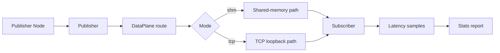

# Phase 8 Design: Benchmark and Demo Documentation

> Roadmap: `2026-06-15-mini-middleware-roadmap.md`
> Prerequisites: Phase 1-7 are complete on `main`: Pub/Sub, discovery, TCP, SHM, QoS, Service/RPC, CLI, and YAML configuration.
> Goal: turn the middleware into a strong campus-recruiting demo by adding a reproducible benchmark entry point and rewriting the README around architecture, verification, and interview talking points.

## 1. Goals and Non-Goals

**Goals**
- Add a benchmark executable that compares same-host TCP and SHM data paths.
- Report human-readable latency and throughput metrics: count, payload bytes, total time, throughput, average latency, p50, p95, and p99.
- Keep benchmark runtime short enough for local demonstration and automated smoke tests.
- Add focused tests for benchmark statistics and argument parsing.
- Rewrite `README.md` so a reviewer can build, run, verify, and understand the project quickly.
- Add simple architecture diagrams in Markdown using Mermaid or ASCII, without adding image-generation or rendering dependencies.
- Mark Phase 8 complete in the roadmap after implementation.

**Non-goals**
- A full performance lab with CPU pinning, warm-up calibration, CSV export, dashboards, or long-duration stress testing.
- Cross-machine benchmark orchestration.
- CI setup, packaging, installers, or release artifacts.
- Dynamic benchmark message schemas beyond the built-in protobuf messages.
- Reworking core transport internals unless a benchmark test exposes a correctness issue.

## 2. Benchmark Command Surface

Create one executable named `mm_bench` under the build tree:

```bash
build/bench/mm_bench --mode shm --count 10000 --payload-bytes 256
build/bench/mm_bench --mode tcp --count 10000 --payload-bytes 256
```

Supported options:

| Option | Default | Meaning |
|---|---:|---|
| `--mode shm|tcp` | `shm` | `shm` enables SHM on the node; `tcp` disables SHM to force the same-host TCP path. |
| `--count N` | `10000` | Number of messages to publish and wait for, from 1 through 100,000. |
| `--payload-bytes N` | `256` | Size of the string payload in each message. |
| `--topic NAME` | `/bench` | Topic used by the benchmark. |
| `--help` | - | Print usage and exit zero. |

The command creates a publisher node and a subscriber node in the same process. This keeps the demo easy to run while still exercising the normal `Node`, discovery, data-plane routing, publisher, and subscriber APIs. `--mode tcp` passes `NodeOptions{.enable_shm = false}` to force the TCP route. `--mode shm` uses the default SHM-enabled route.

## 3. Measured Metrics

Each message carries a per-run identifier, sequence, send timestamp, and string payload. The subscriber ignores other run identifiers and rejects malformed, duplicate, and out-of-range sequences, storing exactly one latency sample per expected sequence.

Output format:

```text
mode: shm
messages: 10000
payload_bytes: 256
received: 10000
duration_ms: 123.45
throughput_msg_s: 81004.45
latency_us_avg: 18.20
latency_us_p50: 16.00
latency_us_p95: 29.00
latency_us_p99: 44.00
```

Latency is measured with `std::chrono::steady_clock` in microseconds. Percentiles use sorted samples and nearest-rank indexing. If `received < count`, the command still prints the received count and returns non-zero after a bounded timeout.

The numbers are demo-grade, not publication-grade. The README will state that results depend on machine load, build type, and WSL/host environment.

## 4. Modules and Responsibilities

| Component | Responsibility |
|---|---|
| `bench/CMakeLists.txt` | Build `mm_bench` and `mm_bench_lib`; link against `mm_core` and `mm_proto`. |
| `bench/include/bench/bench_args.h` | Define `BenchOptions`, `BenchMode`, parse result, and usage text. |
| `bench/src/bench_args.cpp` | Parse and validate command-line options. |
| `bench/include/bench/stats.h` | Define `LatencyStats` and calculation APIs. |
| `bench/src/stats.cpp` | Compute average, percentiles, duration, and throughput. |
| `bench/include/bench/message_codec.h` | Define benchmark payload encoding, decoding, sample admission, and controlled-window helpers. |
| `bench/src/message_codec.cpp` | Implement run-isolated payload handling and actual Protobuf serialized-size calculations. |
| `bench/src/main.cpp` | Run the publisher/subscriber benchmark and print metrics. |
| `tests/test_bench_args.cpp` | Cover valid options, defaults, help, and invalid values. |
| `tests/test_bench_stats.cpp` | Cover average, percentile, throughput, empty samples, and single-sample cases. |
| `tests/test_bench_message_codec.cpp` | Cover run isolation, duplicate/range rejection, payload growth, and the shared in-flight window. |
| `README.md` | Replace early scaffold text with current architecture, features, build, CLI, benchmark, and interview notes. |
| `docs/superpowers/specs/2026-06-15-mini-middleware-roadmap.md` | Mark Phase 8 complete after implementation. |

## 5. Benchmark Data Flow



The benchmark should wait briefly after creating endpoints so discovery and route setup can settle. It should then use the same 16-message in-flight window for SHM and TCP, waiting for accepted sequences to advance before publishing beyond that window. This controlled-window policy makes the two demo runs repeatable and prevents an unbounded burst from overrunning BEST_EFFORT SHM; it is not a peak-throughput or load test. A condition variable waits until all messages arrive or the shared deadline expires, and a failed flow-control wait stops publication immediately.

Payload format:

```text
<run_id>|<sequence>|<send_steady_clock_nanoseconds>|<padding>
```

The parser extracts and validates the run identifier, sequence, and timestamp prefix. Padding is deterministic and sized to reach `payload_bytes`; if the requested size cannot hold the metadata, the effective size grows and is the value reported.

## 6. Error Handling

- Unknown option: print usage and exit `2`.
- Invalid mode: print supported modes and exit `2`.
- Non-positive `--count`: print an error and exit `2`.
- `--count` above the documented 100,000-message demo maximum: print an error and exit `2` before allocating sample storage.
- `--payload-bytes` too small to contain metadata: automatically grow payload to the minimum required size and report the effective size.
- SHM payload whose serialized `StringMsg` exceeds the actual slot capacity: print an error and exit `2`.
- TCP payload whose serialized `StringMsg` inside the actual `DataMessage` topic envelope exceeds `FrameCodec::MAX_PAYLOAD_SIZE`: print an error and exit `2` before startup.
- Timeout before all messages arrive: print partial metrics and exit `1`.
- Serialization or publish failure: print the failing sequence and exit `1`.
- Flow-control deadline failure: print the sequence plus received/required context, stop publishing, and exit `1`.

## 7. README Shape

The README should become the main project landing page:

1. Project one-liner: "DDS-style lightweight robot middleware in C++17."
2. Architecture diagram: discovery plane, data plane, SHM/TCP routing, Node/Pub/Sub/RPC.
3. Feature checklist with completed phases.
4. Build and full verification commands.
5. CLI examples for `mm topic list`, `mm topic echo`, and YAML config.
6. Benchmark examples for SHM and TCP.
7. Demo workflow for a reviewer or interviewer.
8. Interview talking points: epoll, UDP multicast discovery, SHM ring buffer, QoS negotiation, RPC, CMake modularity.
9. Known limitations: demo-grade benchmark, no dynamic protobuf loading, no production-grade security.

The README should use plain Markdown and Mermaid only. It should not depend on external images.

## 8. Testing and Verification

Automated tests:
- `test_bench_args`: default parse, explicit TCP/SHM modes, count and payload parsing, help, missing values, invalid numeric values, the count maximum, and exact SHM/TCP serialized boundaries.
- `test_bench_stats`: empty sample behavior, single sample, multiple samples, percentile ordering, throughput calculation.
- `test_bench_message_codec`: run identifier parsing/filtering, duplicate and sequence-range rejection, effective payload growth, and the 16-message flow-control target.
- Existing full suite remains green.

Manual verification:

```bash
cmake -S . -B build
cmake --build build -j$(nproc)
cd build && ctest --output-on-failure
../build/bench/mm_bench --mode shm --count 1000 --payload-bytes 256
../build/bench/mm_bench --mode tcp --count 1000 --payload-bytes 256
```

The benchmark commands should print all metrics and exit zero on a normal local run.

## 9. Scope Boundary

Phase 8 is the project presentation phase, not a new transport phase. The implementation should favor a clear, repeatable, easy-to-explain controlled-window demo over maximum benchmark sophistication. Its completed-message throughput is not a peak-throughput or load-testing claim. If deeper performance work is needed later, it should become a separate phase with CSV output, pinned processes, cross-machine runs, and more rigorous methodology.
